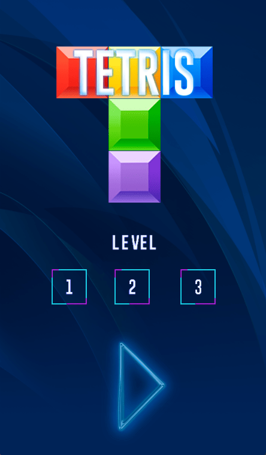
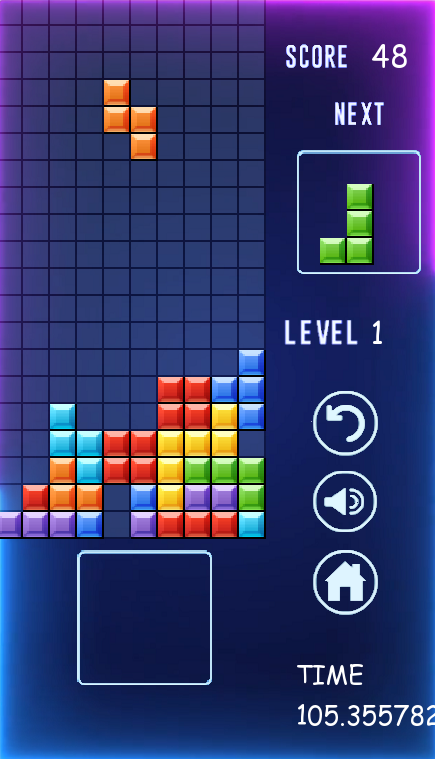
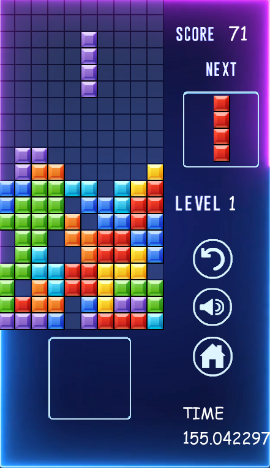

  

  

  

    
    
    
  

  
# Разработка игры «Тетрис»
Техническое задание

Разработчики
1. Терентьев А.В.
2. Коротков К.К.

## Содержание

1. Введение
2. Описание игры
3. Основные требования\
    3.1. Игровой процесс\
    3.2. Пользовательский интерфейс
4. Технологии разработки
5. Системные требования
6. Стадии и задачи разработки

## 1. Введение

Цель проекта - разработать классическую компьютерную игру-головоломку **Тетрис** для одного игрока. Игра должна быть реализована на языке программирования С++ с использованием графической библиотеки SFML.

## 2. Описание игры

**Тетрис** - популярная головоломка, в которой игрок должен вращать и перемещать падающие фигуры, называемые "тетрамино", для создания горизонтальных линий без пробелов. Когда линия сформирована, она исчезает, а все кусочки над ней опускаются вниз. Игра продолжается до тех пор, пока блоки не достигнут верхней части игрового поля, и игрок не сможет больше размещать фигуры.

## 3. Основные требования

### 3.1. Игровой процесс

- Создание и визуализация игрового поля фиксированного размера.
- Генерация случайных фигур "тетрамино" из 7 возможных форм.
- Возможность вращения и перемещения фигур влево, вправо и вниз.
- Ускорение падения фигуры при удержании кнопки "вниз".
- Удаление полностью заполненных горизонтальных линий и сдвиг вышележащих блоков вниз.
- Увеличение скорости падения фигур с ростом уровня сложности.
- Отображение текущего уровня и счета.
- Возможность начать новую игру после завершения предыдущей.
- Возможность включения музыкального сопровождения.

### 3.2. Пользовательский интерфейс

- Отображение игрового поля и следующей фигуры в отдельной области.
- Возможность управления игрой с помощью клавиатуры (кнопки для вращения, перемещения и ускорения падения фигуры).
- Отображение счета, уровня в отдельной области.
- Возможность включения музыкального сопровождения.
- Возможность выхода из игры.

## 4. Технологии разработки

- Язык программирования: C++
- Графическая библиотека: SFML
- Среда разработки: на выбор разработчика.
- Система контроля версий: Git

## 5. Системные требования

Минимальные технические требования:

| Модуль                           | Требование        |
| -------------------------------- | ----------------- |
| ОС                               | Windows 7/8/10/11 |
| Процессор                        | 1 ГГц x86-64      |
| Оперативная память               | 2 Гб ОЗУ          |
| Свободное место на жестком диске | 100 Мб            |

## 6. Стадии и задачи разработки

| Тэги              | Задача                                                           |                              
|-------------------|------------------------------------------------------------------|
|`struct` `main`    | Создание структуры проекта                                       |                                 
|`struct`           | Написание Makefile                                               |                                
|`code`             | Добавление простейшего кода для работы SFML                      |                                
|`main`             | Настройка CI                                                     | 
|`file`             | Добавление в проект `png` файла с макетом игрового поля          |     
|`struct`           | Редактирование Makefile                                          |                       
|`code`             | Реализация функции(ий) создания и отрисовки геометрических фигур |
|`code`             | Реализация функций движения и вращения                           |
|`file`             | Добавление в проект дополнительных `png` файлов                  |     
|`struct`           | Редактирование Makefile                                          |  
|`code`             | Реализация отдельной области для счета и уровня                  | 
|`code`             | Реализация области для просмотра следующей фигуры                | 
|`code`             | Реализация возможности выхода из приложения                      |
|`file`             | Добавление в проект файлов для аудио-сопровождения               | 
|`code`             | Добавление возможности включение аудио-сопровождения             |
|`struct`           | Редактирование Makefile                                          |    
|`code`             | Написание unit-тестов                                            |
|`struct`           | Редактирование Makefile                                          | 
|`code`             | Покрытие тестами всего приложения                                |                                                                  

